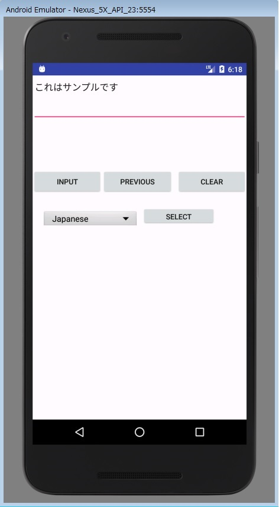

# AndroidSpeechRecognitionSample
Androidのライブラリを使って音声認識を行うAPのサンプル。

## 動作環境
* Android Studio 3.X
* Windows 7 Pro x64
* Emulater :Nexus 5, Android 6.0, API 23

## 部品の説明
* **INPUT** ボタン　　：押すとGoogleの音声入力ダイアログが表示されるので音声を発する。認識された言葉が画面に表示される。他の候補がある場合は最大5個まで赤線の下に合わせて表示される。
* **CLEAR** ボタン　　：画面に表示されている言葉をクリアする。
* **PREVIOUS** ボタン：前回画面に表示されていた言葉を表示する。
* **SELECT** ボタン　 ：言語を選択する。

### 画面サンプル

